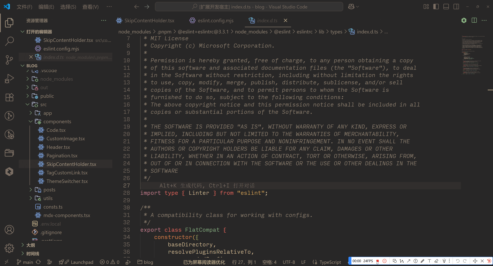
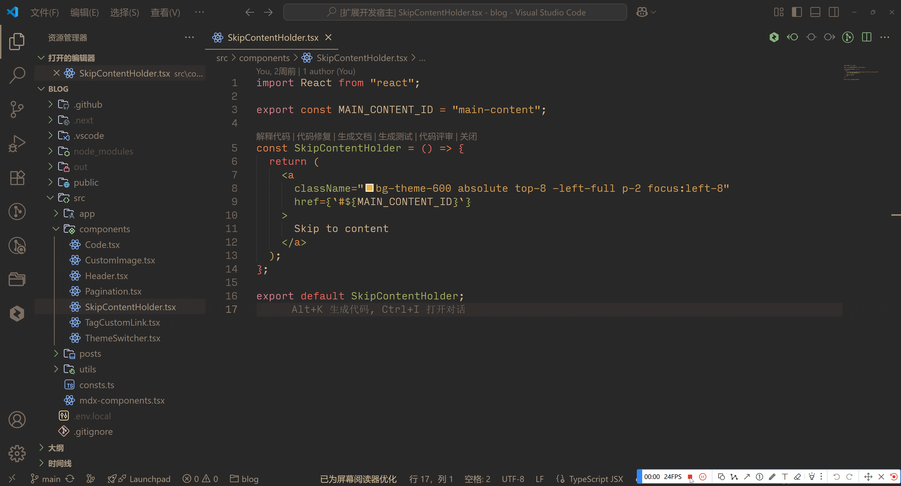
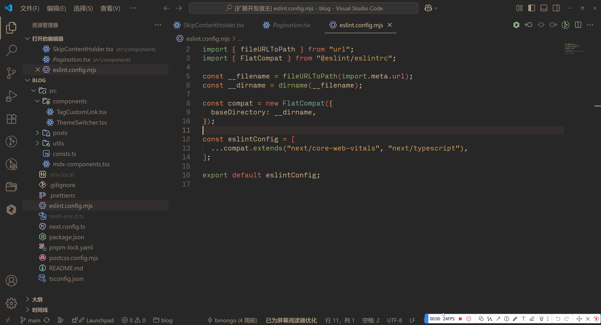

# Vscode Dev Translator Extension

For various translation scenarios in daily development

[中文文档](./doc/README.zh-CN.md) | [தமிழ் ஆவணம்](./doc/README.ta.md)

## Introduction

During development, we often need to translate words, code snippets, and comments, especially in open-source projects where there are many English comments. We frequently need to find translation tools for this purpose. This plugin is designed to solve this problem, supporting Google and Bing translation services (more services will be added in the future).

## Features

### Hover Translation

- When you hover over a word (no need to select it), the translation result and original text will be displayed

- When you select a word, the translation result and original text will be displayed

### Convert to English

Trigger English translation through the `devTranslator.toEnglish` command

- Enter Chinese text and press Enter to convert the content to English
- The result not only includes the translated content but also converts it into related English variables, including camelCase, PascalCase, snake_case, and kebab-case variables. You can select the relevant content and press Enter to use it

### Convert to Chinese

Trigger Chinese translation through the `devTranslator.toChinese` command

- Enter English text and press Enter to convert the content to Chinese

### Convert to Specific Language

Trigger translation to a specific language through the `devTranslator.toOtherLanguage` command

- First select the target language, press Enter, then input the content to be translated, and press Enter again to trigger the translation

### Translation Panel

Open the translation panel through the `devTranslator.openTranslationPanel` command

- On this page, you can select specific translation languages and trigger translation by clicking the translate button

## Configuration

`devTranslator.translator`: Translation service, you can choose Google or Bing

`devTranslator.from`: Source language for translation, you can choose Chinese or English

`devTranslator.to`: Target language for translation, you can choose Chinese or English

`devTranslator.language`: Default is the current VSCode language, this configuration affects the interaction language of the plugin

## Supported Languages

- English
- Simplified Chinese
- Tamil

## Contributing

We welcome contributions to this project! Here are some resources to help you get started:

- [Code of Conduct](./CODE_OF_CONDUCT.md)
- [Contributing Guide](./CONTRIBUTING.md)
- [Development Guide](./DEVELOPMENT.md)

## Support

If this plugin is helpful to you, you can support us in the following ways:

- Give us a star on Github [Bmongo/vscode-translator](https://github.com/Bmongo/vscode-translator)
- Provide feedback on issues or suggestions
- Recommend this plugin to your friends/colleagues
