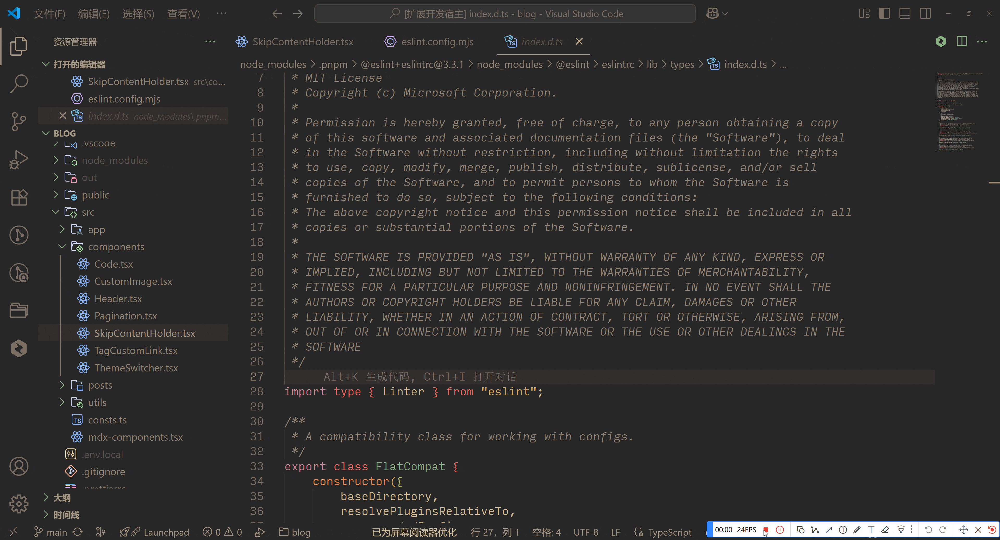
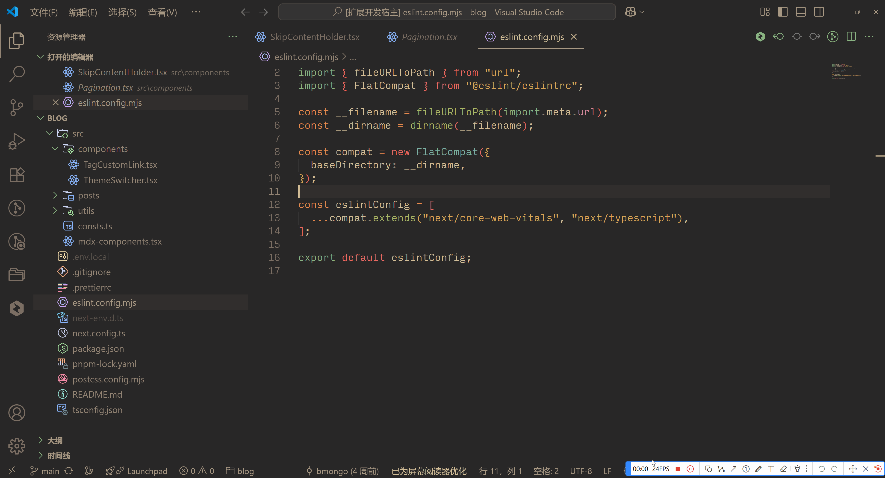
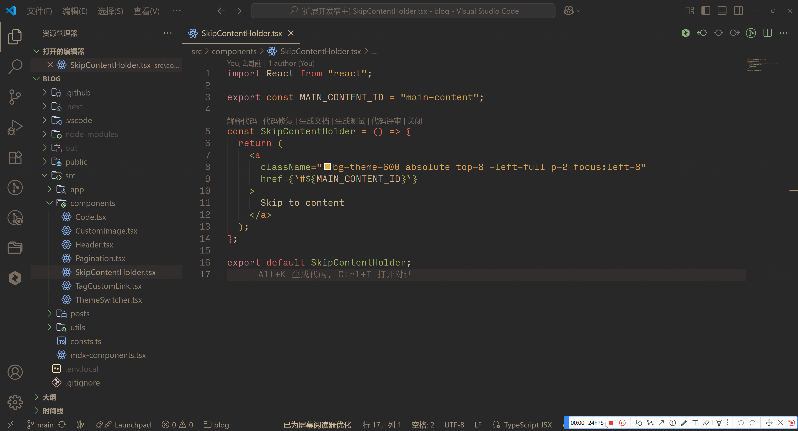

# Vscode மொழிபெயர்ப்பு செருகுநிரல்

அன்றாட மேம்பாட்டில் பல்வேறு மொழிபெயர்ப்பு சூழல்களுக்காக

[English Document](../README.md) | [中文文档](./README.zh-CN.md)

## அறிமுகம்

மேம்பாட்டின் போது, நாங்கள் அடிக்கடி சில சொற்களை மொழிபெயர்க்க வேண்டியிருக்கும், அல்லது சில குறியீட்டு துண்டுகள் மற்றும் குறிப்புகளை மொழிபெயர்க்க வேண்டியிருக்கும், குறிப்பாக திறந்த மூல திட்டங்களில், பல ஆங்கில குறிப்புகள் உள்ளன, அடிக்கடி மொழிபெயர்ப்பு கருவிகளைத் தேட வேண்டியிருக்கும். இந்த செருகுநிரல் இந்த பிரச்சினையைத் தீர்க்க வடிவமைக்கப்பட்டுள்ளது, Google மற்றும் Bing மொழிபெயர்ப்பு சேவைகளை ஆதரிக்கிறது (எதிர்காலத்தில் மேலும் சேவைகள் சேர்க்கப்படும்).

## அம்சங்கள்

### ஹோவர் மொழிபெயர்ப்பு

- நீங்கள் ஒரு சொல்லின் மீது ஹோவர் செய்யும்போது (தேர்ந்தெடுக்க தேவையில்லை), மொழிபெயர்ப்பு முடிவு மற்றும் அசல் உரை காட்டப்படும்

- நீங்கள் ஒரு சொல்லைத் தேர்ந்தெடுக்கும்போது, மொழிபெயர்ப்பு முடிவு மற்றும் அசல் உரை காட்டப்படும்

### ஆங்கிலத்திற்கு மாற்றவும்

`devTranslator.toEnglish` கட்டளை மூலம் ஆங்கில மொழிபெயர்ப்பைத் தூண்டவும்

- சீன உரையை உள்ளிட்டு எண்டர் அழுத்தவும், உள்ளடக்கத்தை ஆங்கிலத்திற்கு மாற்றும்
- முடிவு மொழிபெயர்க்கப்பட்ட உள்ளடக்கத்தை மட்டுமல்லாமல், அதை தொடர்புடைய ஆங்கில மாறிகளாகவும் மாற்றுகிறது, camelCase, PascalCase, snake_case, மற்றும் kebab-case மாறிகள் உள்ளடங்கும். நீங்கள் தொடர்புடைய உள்ளடக்கத்தைத் தேர்ந்தெடுத்து, எண்டர் அழுத்தி பயன்படுத்தலாம்

### சீன மொழிக்கு மாற்றவும்

`devTranslator.toChinese` கட்டளை மூலம் சீன மொழிபெயர்ப்பைத் தூண்டவும்

- ஆங்கில உரையை உள்ளிட்டு எண்டர் அழுத்தவும், உள்ளடக்கத்தை சீன மொழிக்கு மாற்றும்

### குறிப்பிட்ட மொழிக்கு மாற்றவும்

`devTranslator.toOtherLanguage` கட்டளை மூலம் குறிப்பிட்ட மொழிக்கு மொழிபெயர்ப்பைத் தூண்டவும்

- முதலில் இலக்கு மொழியைத் தேர்ந்தெடுத்து, எண்டர் அழுத்தவும், பின்னர் மொழிபெயர்க்க வேண்டிய உள்ளடக்கத்தை உள்ளிட்டு, மீண்டும் எண்டர் அழுத்தி மொழிபெயர்ப்பைத் தூண்டவும்

### மொழிபெயர்ப்பு பலகை

`devTranslator.openTranslationPanel` கட்டளை மூலம் மொழிபெயர்ப்பு பலகையைத் திறக்கவும்

- இந்த பக்கத்தில், நீங்கள் குறிப்பிட்ட மொழிபெயர்ப்பு மொழிகளைத் தேர்ந்தெடுத்து, மொழிபெயர் பொத்தானைக் கிளிக் செய்வதன் மூலம் மொழிபெயர்ப்பைத் தூண்டலாம்

## கட்டமைப்பு

`devTranslator.translator`: மொழிபெயர்ப்பு சேவை, நீங்கள் Google அல்லது Bing ஐத் தேர்வு செய்யலாம்

`devTranslator.from`: மொழிபெயர்ப்புக்கான மூல மொழி, நீங்கள் சீனம் அல்லது ஆங்கிலத்தைத் தேர்வு செய்யலாம்

`devTranslator.to`: மொழிபெயர்ப்புக்கான இலக்கு மொழி, நீங்கள் சீனம் அல்லது ஆங்கிலத்தைத் தேர்வு செய்யலாம்

`devTranslator.language`: இயல்பாக தற்போதைய VSCode மொழியாக உள்ளது, இந்த கட்டமைப்பு செருகுநிரலின் தொடர்பு மொழியை பாதிக்கிறது

## ஆதரிக்கப்படும் மொழிகள்

- ஆங்கிலம்
- எளிமையாக்கப்பட்ட சீனம்
- தமிழ்

## ஆதரவு

இந்த செருகுநிரல் உங்களுக்கு உதவியாக இருந்தால், நீங்கள் பின்வரும் வழிகளில் எங்களை ஆதரிக்கலாம்:

- Github இல் எங்களுக்கு ஒரு நட்சத்திரம் கொடுங்கள் [Bmongo/vscode-translator](https://github.com/Bmongo/vscode-translator)
- சிக்கல்கள் அல்லது ஆலோசனைகள் குறித்த கருத்துக்களை வழங்கவும்
- இந்த செருகுநிரலை உங்கள் நண்பர்கள்/சகாக்களுக்கு பரிந்துரைக்கவும்
