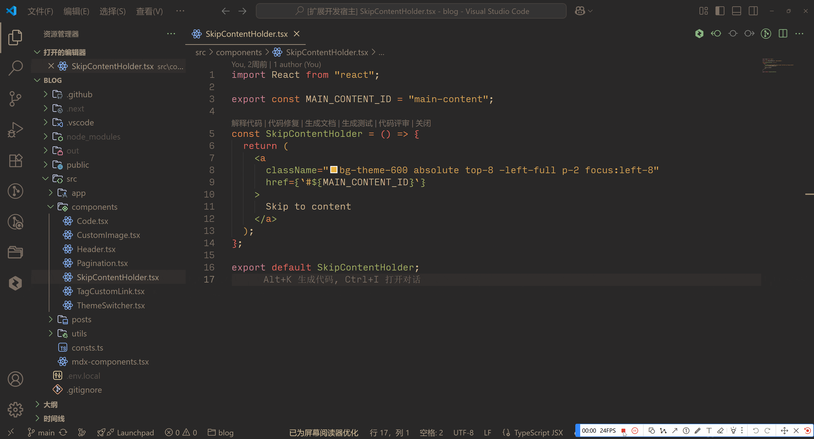

# Vscode 翻译插件

用于日常开发中的各种需要翻译的场景

[English Document](../README.md) | [தமிழ் ஆவணம்](./README.ta.md)

## 简介

在开发过程中，我们经常需要翻译一些单词，或者翻译一些代码片段和注释，特别是开源项目中，存在很多英语注释，经常需要去寻找翻译工具进行翻译，这个插件就是为了解决这个问题的，本插件支持 Google 、 Bing 翻译服务（后续会拓展其他服务）

## 功能

### 悬浮翻译

- 当你悬浮（不需要选中单词）到单词上时，会显示翻译结果和原文

- 当你选中单词时，会显示翻译结果和原文

### 转换成英文

通过 `devTranslator.toEnglish` 命令触发转英文

- 输入中文后按回车将对应内容转换为英文
- 结果不仅包含翻译的内容，还会将翻译内容转换为相关的英文变量，包括大小驼峰、下划线、中划线变量，可以选中相关内容，按回车后负值内容

### 转换成中文

通过 `devTranslator.toChinese` 命令触发转中文

- 输入英文后按回车将对应内容转换为中文

### 转换成指定语言

通过 `devTranslator.toOtherLanguage` 命令触发转指定语言

- 首先选择目标语言，按回车，然后输入需要翻译的内容，按回车后触发翻译

### 翻译面板翻译

通过 `devTranslator.openTranslationPanel` 命令打开翻译面板

- 在该页面中可以选择指定翻译语种，点击翻译后触发翻译

## 配置项

`devTranslator.translator`: 翻译服务，可选择 Google 或者 Bing

`devTranslator.from`: 翻译源语言

`devTranslator.to`: 翻译目标语言

`devTranslator.language`: 默认为当前vscode的语言，该配置会影响插件的交互语言

## 支持语言

- 简体中文
- 英语
- 泰米尔语

## 贡献

我们欢迎对这个项目的贡献！以下是一些帮助您入门的资源：

- [行为准则](../CODE_OF_CONDUCT.md)
- [贡献指南](../CONTRIBUTING.md)
- [开发指南](../DEVELOPMENT.md)

## 支持

如果这个插件对您有帮助，可以通过以下方式支持我们：

- 在 Github 中给个小星星 [Bmongo/vscode-translator](https://github.com/Bmongo/vscode-translator)
- 向我们反馈遇到的问题或者建议
- 向网友/朋友推荐这个插件
